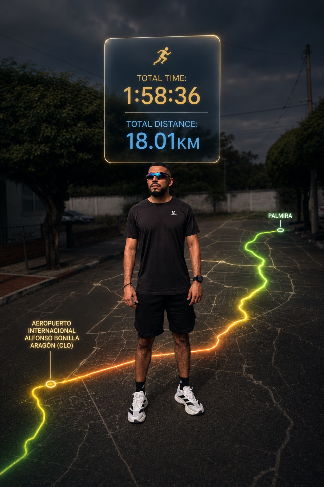
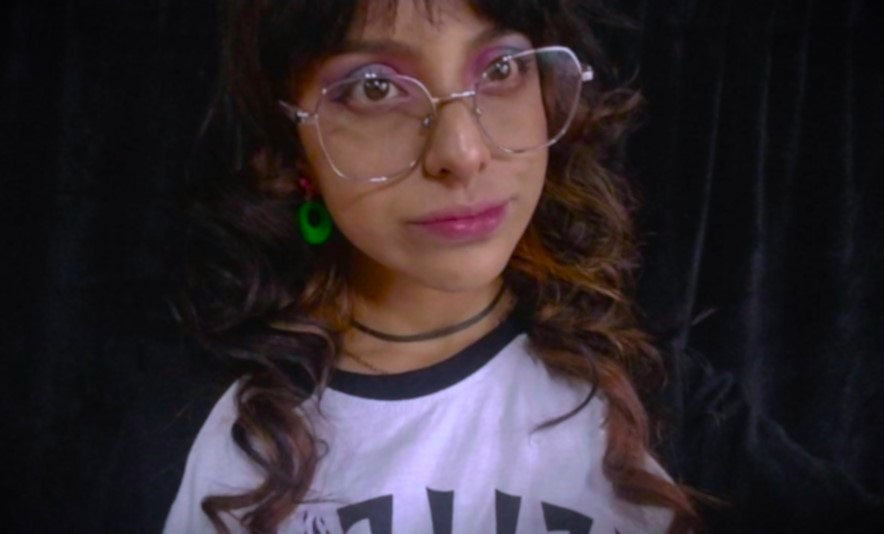

# 213027_2-Wolf-Agile

Repositorio colaborativo para la Etapa 1 del curso **Programación para Videojuegos**.

---

## Integrantes del equipo

### Daniel Andres Santana Rodriguez

**Rol escogido en la industria de videojuegos:** Game Designer

**Ubicación:** Colombia

**Perfil breve:**  
Soy estudiante del curso Programación para Videojuegos y estoy iniciando este proceso de aprendizaje sobre el desarrollo de videojuegos, el uso de GitHub y el trabajo colaborativo. Me interesa conocer cómo se organiza un proyecto desde sus primeras etapas y cómo cada integrante puede aportar desde su rol para construir una idea de videojuego de manera ordenada.

Desde el rol de Game Designer, me llama la atención la parte creativa y de planificación, ya que permite pensar en la experiencia del jugador, las mecánicas básicas y la forma en que una idea puede convertirse poco a poco en un prototipo funcional.

---

### Karen Natalia Fresneda Florez

**ROL:**  
Artista digital y diseñadora de entorno 3D en programas como Unity, ideal para diseñar la historia, reglas, mecanicas y experiencias del usuario dentro del juego.

**UBICACIÓN:**  
Cundinamarca, Colombia.

**DESCRIPCIÓN:**  
Tengo 21 años y actuamente me encuentro en el programa de Ingeniería Multimedia con mayor enfoque en el diseño digital, animación y el modelado en 3D. Además, practico la ilutración tradicional y digital. Puedo llevar a cratividad a diferentes areas como por ejemplo, la creación de personajes para videojuegos.

**Plato favorito:**  
Mi plato favorito son los tacos.

---

### Ana Maria Ordoñez Rincon

**ROL**  
mi rol principalmente siempre ha sido de diseño de interfaz o producción 2d o 3d de personajes y entorno, pero me adapto a lo que se necesite dentro del proyecto

**UBICACIÓN**  
yo resido en Cali, Valle del cauca, Colombia

**DESCRIPCIÓN**  
tengo 26 años, soy egresada del sena en tecnologia en animación 3D, acutalmente trabajo en el sena como instructora de dicha area, llevo 5 años en este trabajo, me he desempeñado tambien como diseñadora grafica para distintas empresas segun salgan trabajos freelance, durante mi estudio mi enfoque han sido los videojuegos, por ende mi portafolio 3D esta orientado a esta rama, ya que trabajado en proyectos de videojuegos y simuladores dentro del sena.

---

### Cristian Andrés Rodríguez Corchuelo

**Presentación personal**  
Cordial saludo para tod@s mi nombre es Cristian Andrés Rodríguez Corchuelo, tengo 29 años, soy un artista, me gusta el dibujo y la música, como por ejemplo retratar y tocar piano, guitarra y cantar, actualmente estoy realizando la tecnología en producción de audio e Ingeniería Multimedia, programas inscritos en la escuela de Ciencias Básicas Tecnologías e Ingenierías y estaré aquí con mucho interés y compromiso en el desarrollo de este programa.

**Rol**  
Rol, Dentro de los roles existentes en un proyecto como lo es la creación de un videojuego...me identifico mucho con el rol de arquitecto ya que comprende esta función Diseñador de Narrativa: Si te apasionan las historias, te encargarás de la trama, los diálogos y la tradición (lore) del mundo del juego

Rol, Dentro de mi experiencia y formación dentro de la UNAD me he podido desempeñar en las labores de producer o (Sound Designer) ya que estos roles comprenden El organizador. Gestiona el cronograma, el presupuesto y los recursos para que el equipo pueda cumplir con los plazos sin morir en el intento y Crea la atmósfera auditiva. Desde el siseo del viento hasta el estruendo de una explosión, pasando por la música que te pone los pelos de punta.

**Plato favorito**  
Plato favorito: Pataconada de camarones: ingredientes:platano hartón entre maduro y verde, camarones, cebolla, tomate, cilantro, mayonesa, salsa de tomate, siracha, limon, aguacate.

---

## Expectativas del equipo

Como equipo esperamos aprender a trabajar de manera colaborativa usando un sistema de control de versiones como GitHub. También esperamos organizar correctamente el repositorio, crear nuestras ramas personales, realizar commits propios y mantener una comunicación clara durante el desarrollo de la actividad.

Nuestro objetivo inicial es cumplir con los requerimientos de la Etapa 1, dejando evidencia del trabajo de cada integrante y preparando una base ordenada para continuar con el proyecto de videojuego en las siguientes etapas.